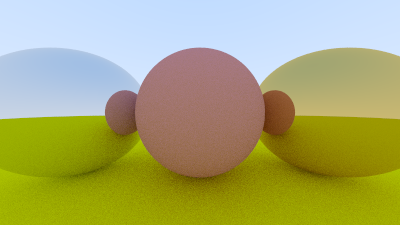

# Ray Tracing

A ray tracing program simulates the behavior of light to create highly realistic images. By tracing the path of
individual rays as they interact with virtual objects, it accurately replicates phenomena such as reflections, shadows,
and refractions, producing visually immersive and lifelike computer-generated scenes

# Demo
Anti aliasing

Diffusion

Metal - Shiny

Metal - Fuzzy

